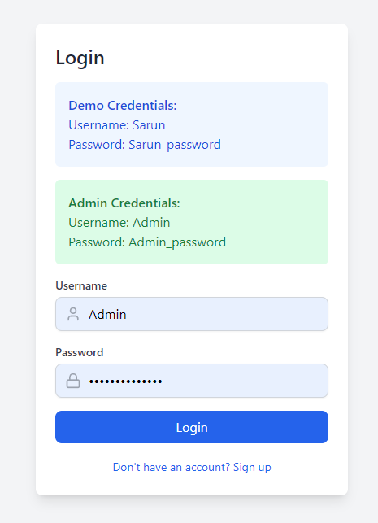
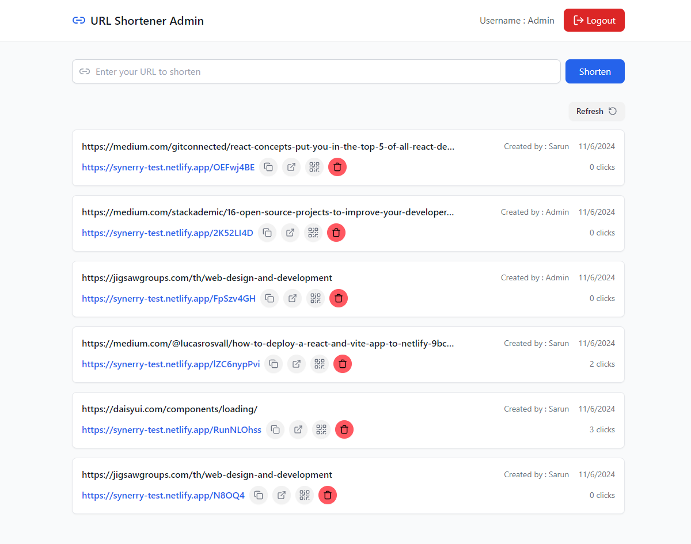

## 🔗 Table of Contents

- [📍 Overview](#-overview)
- [👾 Features](#-features)
- [📁 Project Structure](#-project-structure)
  - [📂 Project Index](#-project-index)
- [🚀 Getting Started](#-getting-started)
  - [☑️ Prerequisites](#-prerequisites)
  - [⚙️ Installation](#-installation)
  - [🤖 Usage](#🤖-usage)


## 📍 Overview





## 👾 Features

- Authentication
  - User
  - Admin
- Shorten URL
- QRcode


## 📁 Project Structure

```sh
└── synerry-test/
    ├── README.md
    ├── backend
    │   ├── .gitignore
    │   ├── Readme.md
    │   ├── app.js
    │   ├── bin
    │   ├── config
    │   ├── controllers
    │   ├── middleware
    │   ├── models
    │   ├── package-lock.json
    │   ├── package.json
    │   ├── public
    │   ├── routes
    │   ├── utils
    │   └── views
    └── frontend
        ├── .gitignore
        ├── README.md
        ├── eslint.config.js
        ├── index.html
        ├── package-lock.json
        ├── package.json
        ├── postcss.config.js
        ├── public
        ├── src
        ├── tailwind.config.js
        ├── tsconfig.app.json
        ├── tsconfig.json
        ├── tsconfig.node.json
        └── vite.config.ts
```


### 📂 Project Index
<details open>
	<summary><b><code>SYNERRY-TEST/</code></b></summary>
	<details> <!-- backend Submodule -->
		<summary><b>backend</b></summary>
		<blockquote>
			<table>
			<tr>
				<td><b><a href='https://github.com/OATZYH/synerry-test/blob/master/backend/app.js'>app.js</a></b></td>
				<td><code>❯ REPLACE-ME</code></td>
			</tr>
			<tr>
				<td><b><a href='https://github.com/OATZYH/synerry-test/blob/master/backend/package-lock.json'>package-lock.json</a></b></td>
				<td><code>❯ REPLACE-ME</code></td>
			</tr>
			<tr>
				<td><b><a href='https://github.com/OATZYH/synerry-test/blob/master/backend/package.json'>package.json</a></b></td>
				<td><code>❯ REPLACE-ME</code></td>
			</tr>
			</table>
			<details>
				<summary><b>config</b></summary>
				<blockquote>
					<table>
					<tr>
						<td><b><a href='https://github.com/OATZYH/synerry-test/blob/master/backend/config/passport.js'>passport.js</a></b></td>
						<td><code>❯ REPLACE-ME</code></td>
					</tr>
					<tr>
						<td><b><a href='https://github.com/OATZYH/synerry-test/blob/master/backend/config/db.js'>db.js</a></b></td>
						<td><code>❯ REPLACE-ME</code></td>
					</tr>
					</table>
				</blockquote>
			</details>
			<details>
				<summary><b>controllers</b></summary>
				<blockquote>
					<table>
					<tr>
						<td><b><a href='https://github.com/OATZYH/synerry-test/blob/master/backend/controllers/authController.js'>authController.js</a></b></td>
						<td><code>❯ REPLACE-ME</code></td>
					</tr>
					<tr>
						<td><b><a href='https://github.com/OATZYH/synerry-test/blob/master/backend/controllers/urlController.js'>urlController.js</a></b></td>
						<td><code>❯ REPLACE-ME</code></td>
					</tr>
					</table>
				</blockquote>
			</details>
			<details>
				<summary><b>bin</b></summary>
				<blockquote>
					<table>
					<tr>
						<td><b><a href='https://github.com/OATZYH/synerry-test/blob/master/backend/bin/www'>www</a></b></td>
						<td><code>❯ REPLACE-ME</code></td>
					</tr>
					</table>
				</blockquote>
			</details>
			<details>
				<summary><b>models</b></summary>
				<blockquote>
					<table>
					<tr>
						<td><b><a href='https://github.com/OATZYH/synerry-test/blob/master/backend/models/URL.js'>URL.js</a></b></td>
						<td><code>❯ REPLACE-ME</code></td>
					</tr>
					<tr>
						<td><b><a href='https://github.com/OATZYH/synerry-test/blob/master/backend/models/User.js'>User.js</a></b></td>
						<td><code>❯ REPLACE-ME</code></td>
					</tr>
					</table>
				</blockquote>
			</details>
			<details>
				<summary><b>views</b></summary>
				<blockquote>
					<table>
					<tr>
						<td><b><a href='https://github.com/OATZYH/synerry-test/blob/master/backend/views/error.jade'>error.jade</a></b></td>
						<td><code>❯ REPLACE-ME</code></td>
					</tr>
					<tr>
						<td><b><a href='https://github.com/OATZYH/synerry-test/blob/master/backend/views/layout.jade'>layout.jade</a></b></td>
						<td><code>❯ REPLACE-ME</code></td>
					</tr>
					<tr>
						<td><b><a href='https://github.com/OATZYH/synerry-test/blob/master/backend/views/index.jade'>index.jade</a></b></td>
						<td><code>❯ REPLACE-ME</code></td>
					</tr>
					</table>
				</blockquote>
			</details>
			<details>
				<summary><b>routes</b></summary>
				<blockquote>
					<table>
					<tr>
						<td><b><a href='https://github.com/OATZYH/synerry-test/blob/master/backend/routes/url.js'>url.js</a></b></td>
						<td><code>❯ REPLACE-ME</code></td>
					</tr>
					<tr>
						<td><b><a href='https://github.com/OATZYH/synerry-test/blob/master/backend/routes/index.js'>index.js</a></b></td>
						<td><code>❯ REPLACE-ME</code></td>
					</tr>
					<tr>
						<td><b><a href='https://github.com/OATZYH/synerry-test/blob/master/backend/routes/auth.js'>auth.js</a></b></td>
						<td><code>❯ REPLACE-ME</code></td>
					</tr>
					<tr>
						<td><b><a href='https://github.com/OATZYH/synerry-test/blob/master/backend/routes/users.js'>users.js</a></b></td>
						<td><code>❯ REPLACE-ME</code></td>
					</tr>
					</table>
				</blockquote>
			</details>
			<details>
				<summary><b>utils</b></summary>
				<blockquote>
					<table>
					<tr>
						<td><b><a href='https://github.com/OATZYH/synerry-test/blob/master/backend/utils/encoding.js'>encoding.js</a></b></td>
						<td><code>❯ REPLACE-ME</code></td>
					</tr>
					</table>
				</blockquote>
			</details>
			<details>
				<summary><b>public</b></summary>
				<blockquote>
					<details>
						<summary><b>stylesheets</b></summary>
						<blockquote>
							<table>
							<tr>
								<td><b><a href='https://github.com/OATZYH/synerry-test/blob/master/backend/public/stylesheets/style.css'>style.css</a></b></td>
								<td><code>❯ REPLACE-ME</code></td>
							</tr>
							</table>
						</blockquote>
					</details>
				</blockquote>
			</details>
			<details>
				<summary><b>middleware</b></summary>
				<blockquote>
					<table>
					<tr>
						<td><b><a href='https://github.com/OATZYH/synerry-test/blob/master/backend/middleware/authMiddleware.js'>authMiddleware.js</a></b></td>
						<td><code>❯ REPLACE-ME</code></td>
					</tr>
					</table>
				</blockquote>
			</details>
		</blockquote>
	</details>
	<details> <!-- frontend Submodule -->
		<summary><b>frontend</b></summary>
		<blockquote>
			<table>
			<tr>
				<td><b><a href='https://github.com/OATZYH/synerry-test/blob/master/frontend/postcss.config.js'>postcss.config.js</a></b></td>
				<td><code>❯ REPLACE-ME</code></td>
			</tr>
			<tr>
				<td><b><a href='https://github.com/OATZYH/synerry-test/blob/master/frontend/tsconfig.node.json'>tsconfig.node.json</a></b></td>
				<td><code>❯ REPLACE-ME</code></td>
			</tr>
			<tr>
				<td><b><a href='https://github.com/OATZYH/synerry-test/blob/master/frontend/package-lock.json'>package-lock.json</a></b></td>
				<td><code>❯ REPLACE-ME</code></td>
			</tr>
			<tr>
				<td><b><a href='https://github.com/OATZYH/synerry-test/blob/master/frontend/tsconfig.json'>tsconfig.json</a></b></td>
				<td><code>❯ REPLACE-ME</code></td>
			</tr>
			<tr>
				<td><b><a href='https://github.com/OATZYH/synerry-test/blob/master/frontend/tailwind.config.js'>tailwind.config.js</a></b></td>
				<td><code>❯ REPLACE-ME</code></td>
			</tr>
			<tr>
				<td><b><a href='https://github.com/OATZYH/synerry-test/blob/master/frontend/tsconfig.app.json'>tsconfig.app.json</a></b></td>
				<td><code>❯ REPLACE-ME</code></td>
			</tr>
			<tr>
				<td><b><a href='https://github.com/OATZYH/synerry-test/blob/master/frontend/package.json'>package.json</a></b></td>
				<td><code>❯ REPLACE-ME</code></td>
			</tr>
			<tr>
				<td><b><a href='https://github.com/OATZYH/synerry-test/blob/master/frontend/vite.config.ts'>vite.config.ts</a></b></td>
				<td><code>❯ REPLACE-ME</code></td>
			</tr>
			<tr>
				<td><b><a href='https://github.com/OATZYH/synerry-test/blob/master/frontend/index.html'>index.html</a></b></td>
				<td><code>❯ REPLACE-ME</code></td>
			</tr>
			<tr>
				<td><b><a href='https://github.com/OATZYH/synerry-test/blob/master/frontend/eslint.config.js'>eslint.config.js</a></b></td>
				<td><code>❯ REPLACE-ME</code></td>
			</tr>
			</table>
			<details>
				<summary><b>src</b></summary>
				<blockquote>
					<table>
					<tr>
						<td><b><a href='https://github.com/OATZYH/synerry-test/blob/master/frontend/src/types.ts'>types.ts</a></b></td>
						<td><code>❯ REPLACE-ME</code></td>
					</tr>
					<tr>
						<td><b><a href='https://github.com/OATZYH/synerry-test/blob/master/frontend/src/main.tsx'>main.tsx</a></b></td>
						<td><code>❯ REPLACE-ME</code></td>
					</tr>
					<tr>
						<td><b><a href='https://github.com/OATZYH/synerry-test/blob/master/frontend/src/index.css'>index.css</a></b></td>
						<td><code>❯ REPLACE-ME</code></td>
					</tr>
					<tr>
						<td><b><a href='https://github.com/OATZYH/synerry-test/blob/master/frontend/src/App.tsx'>App.tsx</a></b></td>
						<td><code>❯ REPLACE-ME</code></td>
					</tr>
					<tr>
						<td><b><a href='https://github.com/OATZYH/synerry-test/blob/master/frontend/src/vite-env.d.ts'>vite-env.d.ts</a></b></td>
						<td><code>❯ REPLACE-ME</code></td>
					</tr>
					</table>
					<details>
						<summary><b>contexts</b></summary>
						<blockquote>
							<table>
							<tr>
								<td><b><a href='https://github.com/OATZYH/synerry-test/blob/master/frontend/src/contexts/AuthContext.tsx'>AuthContext.tsx</a></b></td>
								<td><code>❯ REPLACE-ME</code></td>
							</tr>
							</table>
						</blockquote>
					</details>
					<details>
						<summary><b>components</b></summary>
						<blockquote>
							<table>
							<tr>
								<td><b><a href='https://github.com/OATZYH/synerry-test/blob/master/frontend/src/components/AdminProtectedRoute.tsx'>AdminProtectedRoute.tsx</a></b></td>
								<td><code>❯ REPLACE-ME</code></td>
							</tr>
							<tr>
								<td><b><a href='https://github.com/OATZYH/synerry-test/blob/master/frontend/src/components/URLShortener.tsx'>URLShortener.tsx</a></b></td>
								<td><code>❯ REPLACE-ME</code></td>
							</tr>
							<tr>
								<td><b><a href='https://github.com/OATZYH/synerry-test/blob/master/frontend/src/components/URLAdminList.tsx'>URLAdminList.tsx</a></b></td>
								<td><code>❯ REPLACE-ME</code></td>
							</tr>
							<tr>
								<td><b><a href='https://github.com/OATZYH/synerry-test/blob/master/frontend/src/components/RedirectIfAuth.tsx'>RedirectIfAuth.tsx</a></b></td>
								<td><code>❯ REPLACE-ME</code></td>
							</tr>
							<tr>
								<td><b><a href='https://github.com/OATZYH/synerry-test/blob/master/frontend/src/components/ProtectedRoute.tsx'>ProtectedRoute.tsx</a></b></td>
								<td><code>❯ REPLACE-ME</code></td>
							</tr>
							<tr>
								<td><b><a href='https://github.com/OATZYH/synerry-test/blob/master/frontend/src/components/AuthForm.tsx'>AuthForm.tsx</a></b></td>
								<td><code>❯ REPLACE-ME</code></td>
							</tr>
							<tr>
								<td><b><a href='https://github.com/OATZYH/synerry-test/blob/master/frontend/src/components/URLList.tsx'>URLList.tsx</a></b></td>
								<td><code>❯ REPLACE-ME</code></td>
							</tr>
							</table>
						</blockquote>
					</details>
					<details>
						<summary><b>pages</b></summary>
						<blockquote>
							<table>
							<tr>
								<td><b><a href='https://github.com/OATZYH/synerry-test/blob/master/frontend/src/pages/LoginPage.tsx'>LoginPage.tsx</a></b></td>
								<td><code>❯ REPLACE-ME</code></td>
							</tr>
							<tr>
								<td><b><a href='https://github.com/OATZYH/synerry-test/blob/master/frontend/src/pages/RedirectPage.tsx'>RedirectPage.tsx</a></b></td>
								<td><code>❯ REPLACE-ME</code></td>
							</tr>
							<tr>
								<td><b><a href='https://github.com/OATZYH/synerry-test/blob/master/frontend/src/pages/AdminPage.tsx'>AdminPage.tsx</a></b></td>
								<td><code>❯ REPLACE-ME</code></td>
							</tr>
							<tr>
								<td><b><a href='https://github.com/OATZYH/synerry-test/blob/master/frontend/src/pages/RegisterPage.tsx'>RegisterPage.tsx</a></b></td>
								<td><code>❯ REPLACE-ME</code></td>
							</tr>
							<tr>
								<td><b><a href='https://github.com/OATZYH/synerry-test/blob/master/frontend/src/pages/Dashboard.tsx'>Dashboard.tsx</a></b></td>
								<td><code>❯ REPLACE-ME</code></td>
							</tr>
							<tr>
								<td><b><a href='https://github.com/OATZYH/synerry-test/blob/master/frontend/src/pages/UnauthorizedPage.tsx'>UnauthorizedPage.tsx</a></b></td>
								<td><code>❯ REPLACE-ME</code></td>
							</tr>
							</table>
						</blockquote>
					</details>
					<details>
						<summary><b>utils</b></summary>
						<blockquote>
							<table>
							<tr>
								<td><b><a href='https://github.com/OATZYH/synerry-test/blob/master/frontend/src/utils/apiConnect.ts'>apiConnect.ts</a></b></td>
								<td><code>❯ REPLACE-ME</code></td>
							</tr>
							</table>
						</blockquote>
					</details>
				</blockquote>
			</details>
			<details>
				<summary><b>public</b></summary>
				<blockquote>
					<table>
					<tr>
						<td><b><a href='https://github.com/OATZYH/synerry-test/blob/master/frontend/public/_redirects'>_redirects</a></b></td>
						<td><code>❯ REPLACE-ME</code></td>
					</tr>
					</table>
				</blockquote>
			</details>
		</blockquote>
	</details>
</details>


## 🚀 Getting Started

### ☑️ Prerequisites

Before getting started with synerry-test, ensure your runtime environment meets the following requirements:

- **Programming Language:** JavaScript & TypeScript
- **Package Manager:** Npm


### ⚙️ Installation

Install synerry-test following methods:

**Build from source:**

1. Clone the synerry-test repository:
```sh
❯ git clone https://github.com/OATZYH/synerry-test
```

2. Navigate to the project directory:
```sh
❯ cd synerry-test
```

3. Navigate to backend & frontend:
```sh
❯ cd backend 
```
```sh
❯ cd frontend
```

**Using `npm`**

```sh
❯ npm install
```

### 🤖 Usage
Run synerry-test using the following command:

**`backend`**
```sh
npm start
```

**`frontend`**
```sh
npm run dev
```